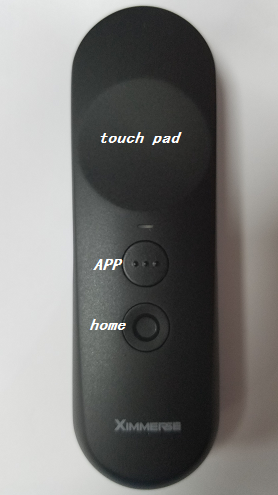
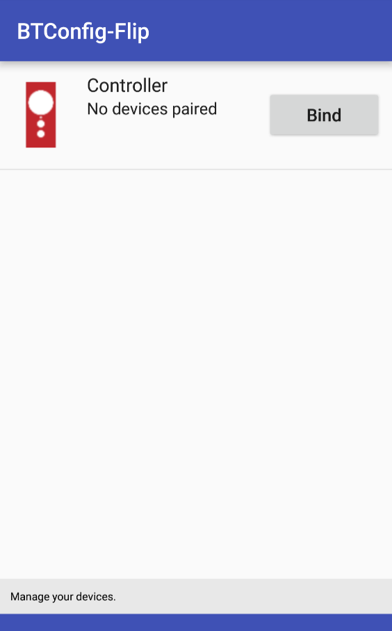
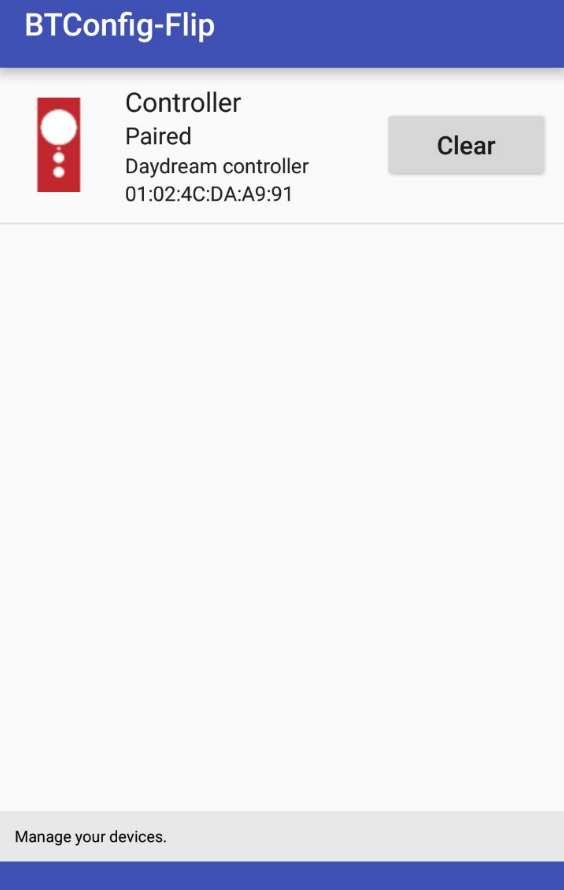
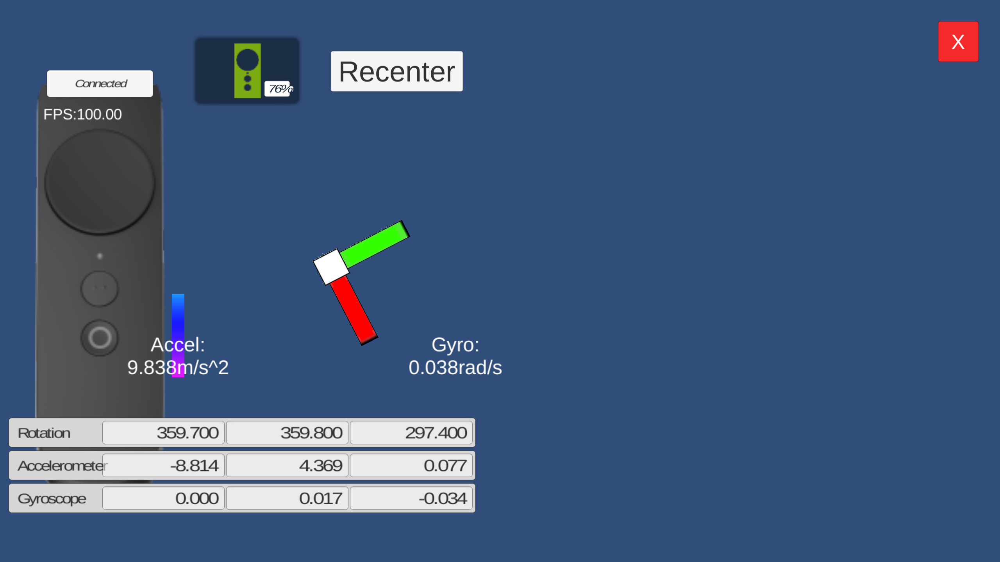
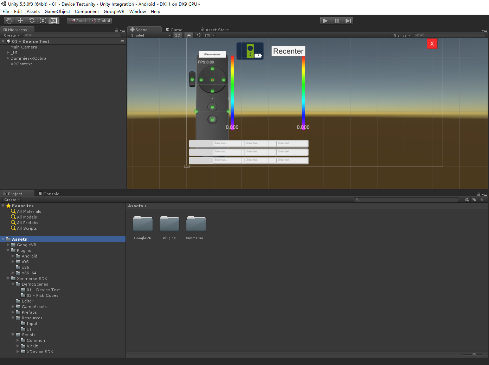
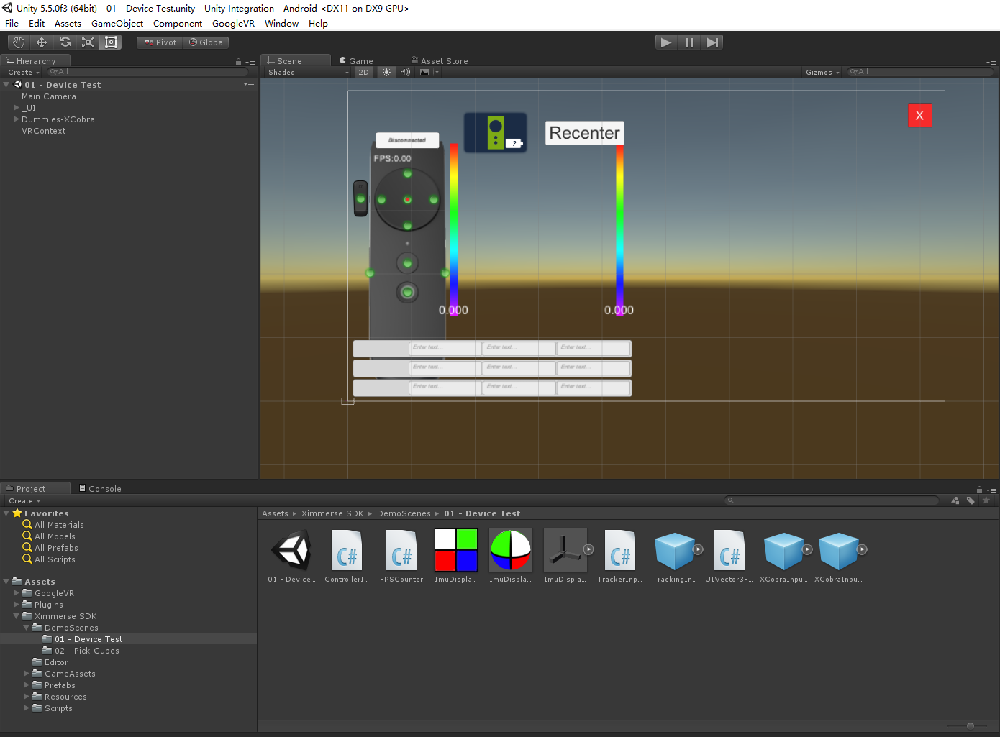
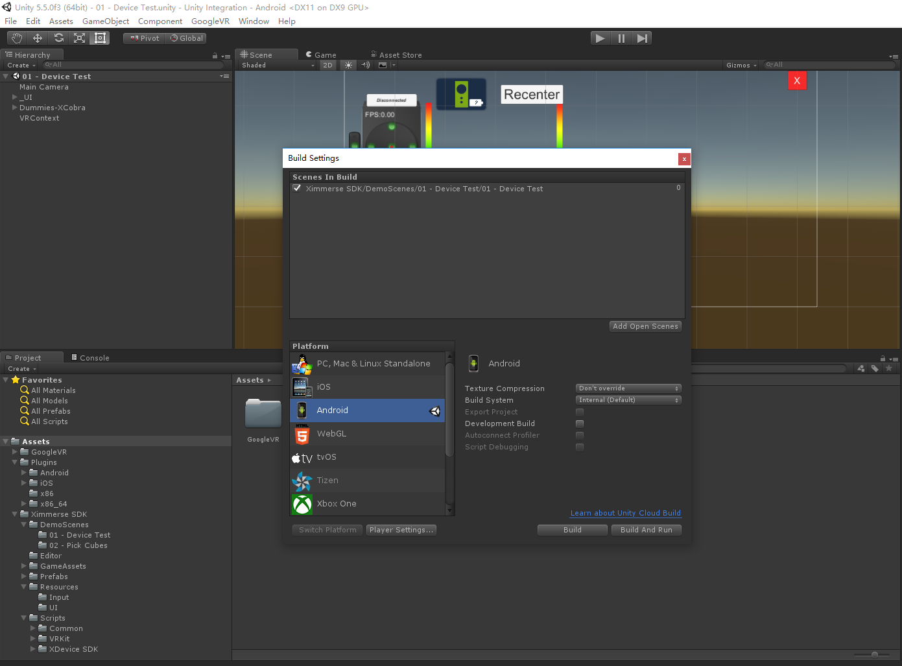
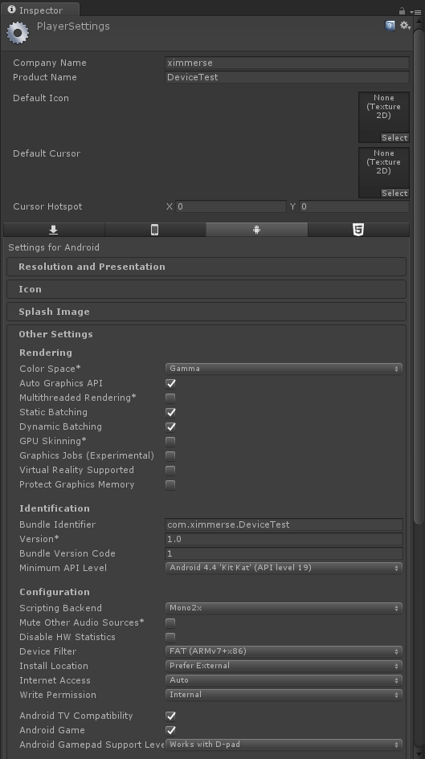

<h1>Flip Controller SDK</h1>
<h3>Table of Content</h3>
<!--toc-->

- [SDK Versions](#sdk-versions)
- [Terminologies](#terminologies)
- [Directory Description](#directory-description)
- [Button Mapping](#button-mapping)
- [Setup Guide](#setup-guide)
	- [Android Phone](#android-phone)
		- [1 Install BTConfig](#1-install-btconfig)
		- [2 Controller pairing](#2-controller-pairing)
		- [3 Run DeviceTest](#3-run-devicetest)
		- [4 Demo](#4-demo)
	- [Window PC(TBD)](#window-pctbd)
- [Developer Guide](#developer-guide)
	- [Unity](#unity)
		- [1 Dev Environment](#1-dev-environment)
		- [2 Preparation](#2-preparation)
		- [3 SDK Setup Guide](#3-sdk-setup-guide)
		- [4 Scripting Guide](#4-scripting-guide)
	- [Cardboard(TBD)](#cardboard)
	- [Windows Natvie C++(TBD)](#windows-natvie-ctbd)
	- [Android Native(TBD)](#android-nativetbd)

<!-- tocstop -->

# SDK Versions
Verion | ChangeLOG | Release Date
---|--- |---
v1.0.1-beta | Beta Release Flip Controller Unity3D SDK(Android/Win10) Add Controller pairing tool for Android(BTConfig)|2017.03.13

# Terminologies

Terminology | Explanation
---|---
X-Cobra|3DoF controller or Flip Controller

# Directory Description
* **Demo**  	  ：Runnable demo that works on major HMDs
* **Document\Flip** ：Documentations
* **Tools**：Tools required for PC or Android platforms 
* **Unity**：Flip Controller Unity SDK  

&emsp;
# Button Mapping

>  注：Click `home` button to recenter the controller

&emsp;
# Setup Guide

&emsp;
## Android Phone
Steps：

1) Install BTConfig

2) Controller Pairing

3) Install Demo Applications

### 1 Install BTConfig
1.1 Install the following apks on Android phone:
> - [BTConfig.apk](./../../Tools/BTConfig[1.0.0-Flip].apk): Controller pairing tool
> - [DeviceTest.apk](./../../Demo/DeviceTestX3C01[v1.0.0].apk)：A Flip testing tool

&emsp;
### 2 Controller Pairing

2.1 Put batteries into the controller, hold down `Home` button to turn on controller.

2.2 Turn on BLE feature on the phone and open BTConfig Application.

2.3 Press Bind button on the screen and then hold down both `App` button and `Home` button. It should show `Paired` on the screen shortly. 

> This step is only required on initial setup. If a different controller needs to be paired, press `Clear` button on the screen and then repeat controller pairing process. 

&emsp;

### 3 Run DeviceTest
Open DeviceTest application. You should be able to see the data of the controller reflected on the screen, including orientation, button press and touch pad data.

  

&emsp;
### 4 Demo
APK Name | HMD
---|---
[PickCubesDOF3Cardboard.apk](./../../Demo/PickCubesCardboardX3C01[v1.0.0].apk) | Cardboard
[Playground for Cardboard.apk](./../../Demo/Playground for Cardboard.apk)| Cardboard

## Window PC(TBD)

&emsp;
# Developer Guide

## Unity

### 1 Dev Environment
Environment | Requirements
---|---
Operating System  |Windows 10 Mac OSX >= 10.7.5
Bluetooth LE Dongle| Must Support BLE 4.0
Unity3D|5.4+
Apple XCode|TBD
Android Studio|TBD

### 2 Preparation

1) Follow instructions in [Setup Guide](#Setup Guide)

2) Download [Unity SDK Plugin for Flip Controller](https://github.com/Ximmerse/SDK_Flip/tree/master/Unity)

### 3 SDK Setup Guide
1) Open an Unity3D project, then import the SDK by going to menu item：
> Assets -> Import -> Package -> Custom Package

Import "Unity SDK Plugin for Flip Controller"

  

&emsp;

2) Go to DeviceTest Scene：
> Assets -> Ximmerse SDK -> DemoScenes -> 01 - Device Test

  
&emsp;

3) Create Testing Application
- 1. Switch to Android Platform(using Android platform as example)：
> Files -> Build Setting -> Select `Android` -> Switch Platform

  
&emsp;

- 2. Player Settings
> Hit `Player Setting` button，change Min API Level to 19.

  

&emsp;

- 3. Hit `Build` button to generate APK

### 4 Scripting Guide
#### Key Classes
* XDevicePlugin

	>A bridge between Unity and native SDK layer.	
	Note：Normally, this class is not used directly. All the data from this class is raw data and must be further calculated to be used correctly. 
	
	>Namespace 	
	>Ximmerse.InputSystem
	
* ControllerInput
	>Contains major controller data, including button state, rotiation and position, etc.
	
	>Namespace	
	>Ximmerse.InputSystem
	
* TrackedObject
	>A MonoBehavior that wraps up ControllerInput.	
* TrackedHead
	>Inherited from TrackedObject. It contains HMD data.
	
* ControllerInputManager
	>A singleton class that manages all ControllerInputs.	
		
	>Namespace	
	>Ximmerse.InputSystem		
	
* DeviceStatus
	>Contains controller connection status and battery power level data, etc.
	
#### Buttons 
* controllerInput.GetButton(ControllerButton buttonMask) 
	
	>Button state: pressed or released 
	
* controllerInput.GetButtonDown(ControllerButton buttonMask) 

	>Clicked (compared to last frame)
	
* controllerInput.GetButtonUp(ControllerButton buttonMask) 

 	>Released (compared to last frame)
 	

#### TouchPos 
* controllerInput.touchPos 

#### Rotation 
* ControllerInput.GetRotation() 

#### Accelerometer 
* ControllerInput.GetAccelerometer() 

#### Gyroscope 
* ControllerInput.GetGyroscope() 

#### Battery 
* ControllerInput.batteryLevel 

#### ConnectionState 
* ControllerInput.connectionState 

#### Recenter 
* ControllerInput.Recenter()

## Cardboard
## Windows Natvie C++(TBD)
## Android Native(TBD)
