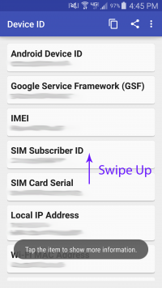
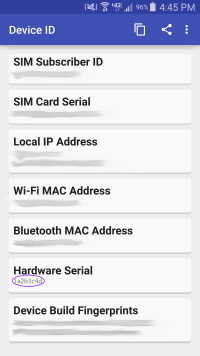

<h1>Flip Controller FAQ</h1>

&emsp;

**1. When running application on Gear VR, "thread priority secority escption makesure the apk is signed" shows up**

>  A pretty common task with developing for the GearVR is getting a development signature so that your device can run a pre-production application. This process only works for officially supported GearVR devices. Note that you must also be logged into Oculus platform on this and have been given access to the application in question through a build's subscribed users.

>1) Get Your Device ID aka Hardware Serial Number

>This ID is referred to in various contexts as a “Device ID.” The instructions below are a less technical way to get this information. If you have adb set up on your computer, you could follow [Oculus's directions](https://developer.oculus.com/osig/#serial-form-instructions).

>a) Download & Install App

>We recommend [Device ID by Evozi](https://play.google.com/store/apps/details?id=com.evozi.deviceid&hl=en).

>b) Open App, Find Hardware Serial

>Swipe up to reveal the Hardware Serial Field. You'll want to write down/save this information. It generally will be a combination of letters and numbers somewhere around 8 to 17 characters long.

>2) Download Oculus Signature from Oculus

>Go to the [Oculus Signature File (osig) Generator](https://developer.oculus.com/osig/). You'll need to be logged in with an Oculus Account, which is free to sign up for. Enter the ID and click “Download File.” This is the Oculus Signature that is necessary for a GearVR app to be built for your device.

&emsp;

**2. How to Use BTConfig in All-In-One HMD?**

>  Use software like Vysor or Total Control to control the HMD remotely.
